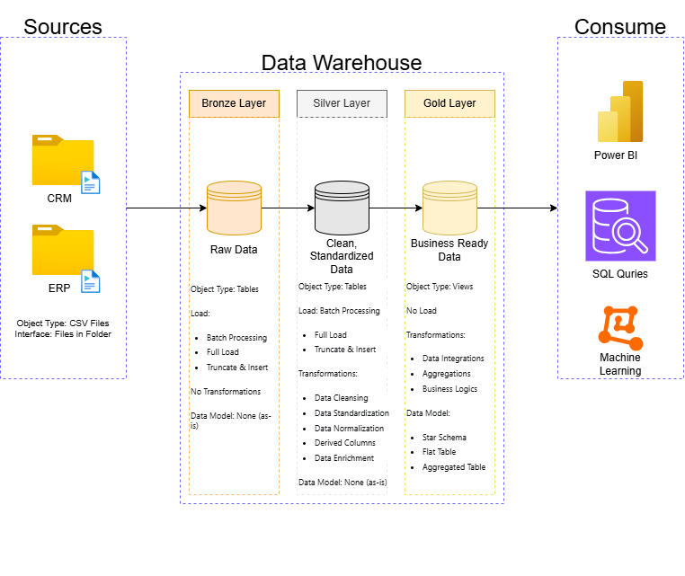

# sql-data-warehouse-projoct
A SQL Data Warehouse project implementing the Bronze–Silver–Gold architecture with structured ETL processes, naming conventions, and Git version control.

# 🗄️ SQL Data Warehouse Project

## 📌 Overview
This project demonstrates the design and implementation of a **SQL-based Data Warehouse** using a **multi-layer architecture** (Bronze, Silver, and Gold).  
It follows a structured ETL (Extract, Transform, Load) approach, Git-based version control, and standardized naming conventions to ensure scalability and collaboration.  

---

## 🎯 Project Objectives
- Build a **scalable SQL Data Warehouse** following the **Bronze-Silver-Gold** architecture.  
- Apply **ETL best practices**: ingestion, cleaning, and transformation.  
- Demonstrate **portfolio-ready SQL skills** in schema design, queries, and documentation.  
- Use **GitHub** for version control, collaboration, and professional presentation.  
- Deliver a structured project that could serve as a **template for enterprise data warehousing**.  

---

## 🛠️ Project Requirements
- **Database**: SQL Server (can adapt to PostgreSQL/MySQL if required).  
- **Tools**:  
  - SQL Server Management Studio (SSMS) / Azure Data Studio  
  - GitHub for version control  
  - Draw.io (or Lucidchart) for ER diagrams  
- **Skills Needed**:  
  - SQL (DDL, DML, DQL)  
  - ETL and data modeling concepts  
  - Git basics  

---

## 📐 Project Specifications
### 🔹 Data Warehouse Layers
1. **Bronze Layer**  
   - Raw ingestion from source systems.  
   - Naming convention: `source_system_entity` (e.g., `crm_customer_info`).  

2. **Silver Layer**  
   - Cleaned, standardized, and conformed data.  
   - Consistent column naming and surrogate keys.  

3. **Gold Layer**  
   - Business-ready tables (dimensions, facts, aggregates).  
   - Naming convention:  
     - Dimensions: `dim_entity` (e.g., `dim_customers`)  
     - Facts: `fact_entity` (e.g., `fact_sales`)  
     - Aggregates: `agg_metric_period` (e.g., `agg_monthly_sales`)  

### 🔹 Naming Conventions
- **Case**: `snake_case` (e.g., `customer_info`).  
- **Columns**:  
  - Surrogate keys → `table_name_key` (e.g., `customer_key`).  
  - Metadata → prefix `dw_` (e.g., `dw_load_date`).  
- **Procedures**: `load_<layer>` (e.g., `load_bronze_sales`).

## 📊 Data Architecture

The project follows a **Bronze → Silver → Gold** layered architecture.

### 🔹 Git Repository Structure

---

## 🚀 Current Progress
- ✅ Epics created (Bronze, Silver, Gold).  
- ✅ Naming conventions finalized.  
- ✅ GitHub repository initialized with structure.  
- ✅ SQL Server database and schemas created (`bronze`, `silver`, `gold`).  
- 🔜 Next step: **Analyze source systems** for Bronze layer ingestion.  

---

## 📄 License
This project is licensed under the **MIT License**.  
You are free to use, modify, and distribute this project for educational or professional purposes.  

---

## 👨‍💻 About Me
Hi! I’m **Howard Lee Hao Zhe**, a Computer Science student passionate about:  
- 📊 Data Engineering & SQL  
- 🧮 Mathematics & Problem Solving  
- ♟️ Critical Thinking through Chess  
- 💻 Building real-world portfolio projects  

I enjoy **continuous learning and self-improvement**, and I’m working towards a career in **data-driven technologies**.  

👉 Feel free to connect with me on GitHub or reach out to collaborate!  

---
